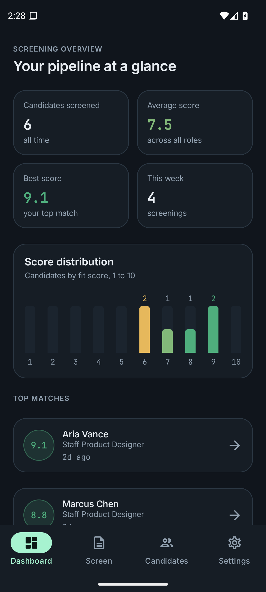
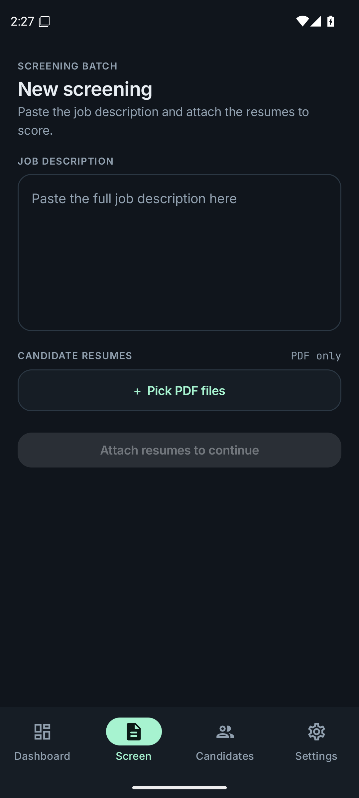
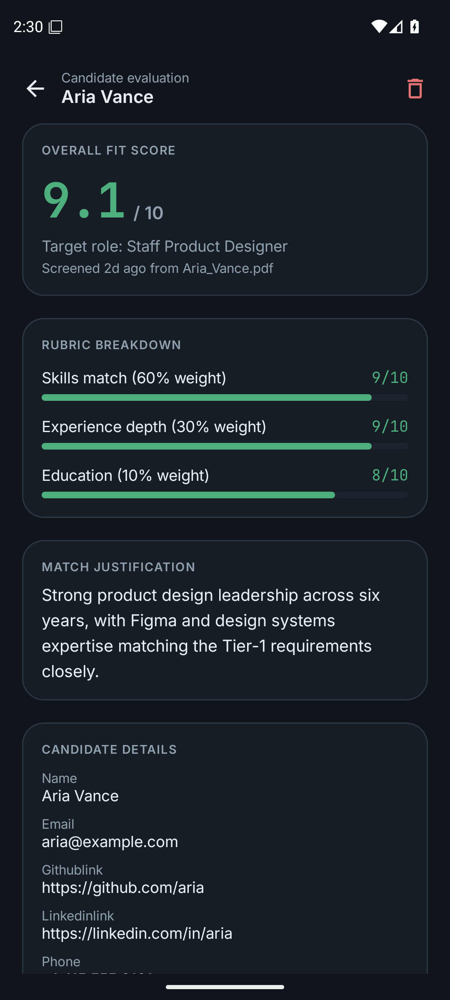
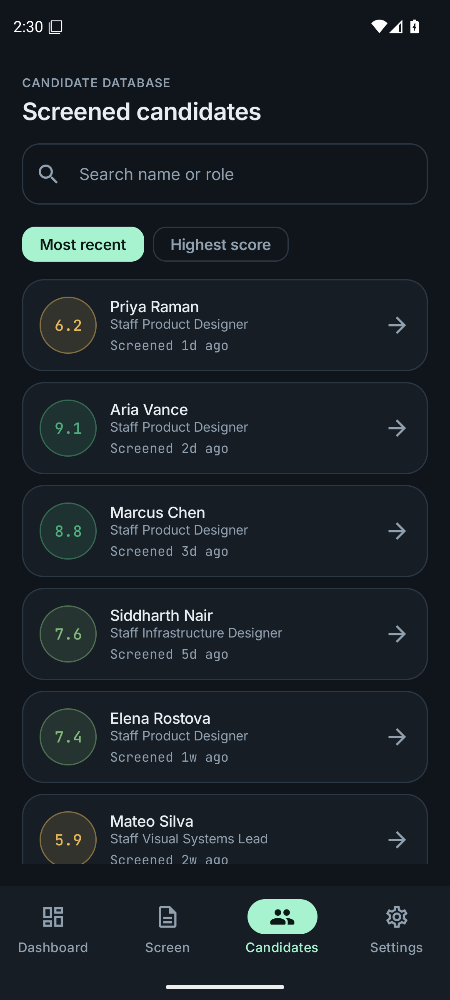
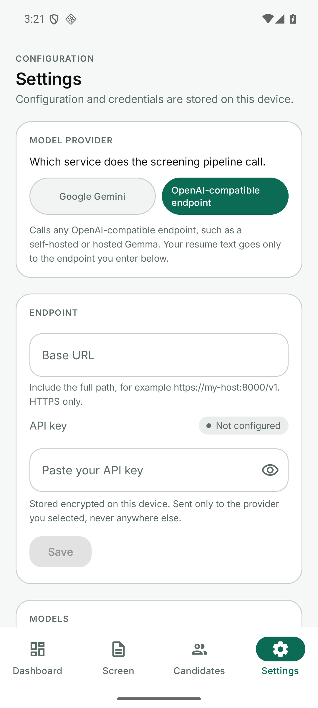
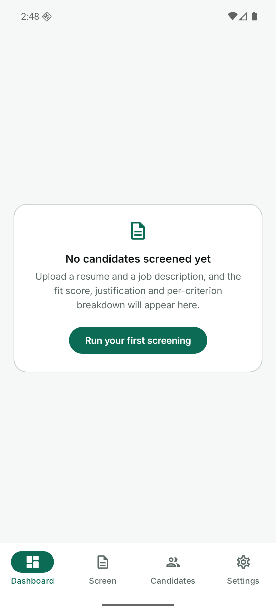

# Resume Screener

Native Android port of [Smart-Resume-Screener](https://github.com/Yuvraj-ai/Smart-Resume-Screener),
a Streamlit app that scores resumes against a job description using an LLM.

Upload resume PDFs with a job description, get a 1-10 fit score with a written
justification and a per-criterion breakdown. Everything stays on the device.

<p align="center">
  
  
  
  
</p>

## What it does

- Scores a resume against a job description from 1 to 10
- Breaks the score down by **skills 60% / experience 30% / education 10%**
- Processes a batch of PDFs, isolating per-file failures
- Stores every result locally, with search, sort and delete
- Works with **Google Gemini** or **any OpenAI-compatible endpoint**, including
  a self-hosted Gemma

## Install

Download `ResumeScreener-0.1.0.apk` from the
[latest release](https://github.com/Yuvraj-ai/Smart-Resume-Screener-Andorid/releases/latest)
and sideload it. It is a signed release build; allow installs from your file
manager when prompted.

Minimum Android 8.0 (API 26). Network access is needed for the model API.

## First run

1. Open **Settings**
2. Pick a provider
3. Enter the matching API key and tap **Load models from endpoint** or
   **Test connection**

<p align="center">
  
  
</p>

Your key is encrypted with the Android Keystore, excluded from backup, and sent
only to the provider you selected. It is never written to a URL and never
bundled in the APK.

## Providers

Both are always available and both keys are stored side by side. Switching
provider never touches the other one's stored credential.

| | Google Gemini | OpenAI-compatible endpoint |
| --- | --- | --- |
| Endpoint | fixed by Google | you supply the base URL |
| Auth | `x-goog-api-key` | `Authorization: Bearer` |
| Models | rolling aliases | whatever your endpoint lists |
| Schemas | `responseSchema` | `response_format.json_schema` |

Verified live against `gemma-4-31B-it` at an OpenAI-compatible endpoint, and
against Gemini. Verified in `.migration/parity-audit.md`.

## Using it

**Screen** — paste a job description, or paste a link to the posting and the app
will fetch it. Attach one or more PDFs and tap Run. Each file moves through the
pipeline visibly, and a file that fails does not discard the ones that
succeeded.

**Dashboard** — totals, average and best score, a score distribution, top
matches and recent activity.

**Candidates** — everything screened, searchable by name or role, sortable by
date or score. Tap through for the full analysis, or delete.

## Design

Dark and light themes, a Material 3 expressive shape and motion system, and a
score colour spectrum that carries meaning rather than decoration. Built with a
design system generated in Google Stitch and Sleek; the palette, typography and
score ramp are defined in `ui/theme/`. See `design/HANDOFF.md`.

## Build from source

Needs JDK 17 and the Android SDK (platform 35).

```bash
export JAVA_HOME=/path/to/jdk17

./gradlew testDebugUnitTest          # 62 unit tests
./gradlew connectedDebugAndroidTest  # 8 instrumented UI tests, needs a device
./gradlew assembleRelease             # signed APK
```

Release signing reads `release.jks` and credentials from `gradle.properties`,
both gitignored.

## Privacy

Everything is stored in an on-device Room database. There is no sync, no
telemetry and no upload path. The only data leaving the device is the resume and
job-description text sent to whichever model provider you configured, because
that is what scoring requires.

## Notes and limitations

- Model defaults use Google's rolling aliases (`gemini-flash-latest`,
  `gemini-pro-latest`). The pinned `gemini-2.5-pro` from the original app was
  found retired for new users during live testing.
- Scanned or image-only PDFs cannot be read: extraction needs a text layer, and
  such a PDF is reported as an error rather than silently producing nothing.
- MongoDB sync is not implemented. Android cannot speak the MongoDB wire
  protocol, so results are local only.

`.migration/parity-audit.md` records what was verified against real services and
what remains unproven.

## Migration

`.migration/` holds the full migration specification: feature inventory,
architecture, screen map, data model, API contract, security audit, approved
decisions, and the final parity audit.

## License

MIT
